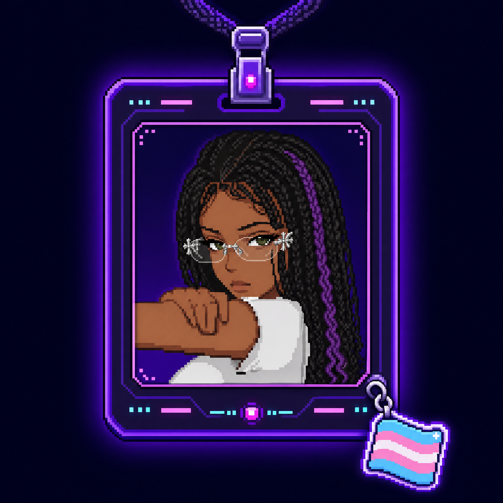

<p align="center">
  
</p>



<h1>Khaleesi Saithen</h1>

<p><strong><code>ciência de dados</code> · <code>python</code> · <code>IA</code> · <code>aprendendo em público</code></strong></p>

<p>Eu transformo curiosidade em projetos, perguntas em pesquisa e problemas reais em soluções que podem ser usadas.</p>

<p>
  <a href="https://github.com/khaleesisaithe"></a><br />
  <a href="https://www.linkedin.com/in/khaleesisaithe"></a><br />
  <a href="https://github.com/Khaleesisaithe/meuPorti"></a>
</p>

<p>
  
  
</p>

<br clear="left" />


```bash
> whoami
```

## 👩‍💻 sobre mim


Sou **Khaleesi Saithen**, estudante e futura profissional de **Ciência de Dados**, construindo minha primeira oportunidade na área.

Minha trajetória passou por atendimento, operações e varejo. Essas experiências me ensinaram que, antes de criar uma solução, é preciso entender o problema de quem realmente vai utilizá-la.

Hoje estudo **Python, análise e visualização de dados, desenvolvimento web, bancos de dados, Inteligência Artificial e automação**. Gosto de aprender fazendo e transformar perguntas em projetos reais, mesmo quando o caminho começa com pesquisa, tentativa e erro.

> **Curiosidade como motor. Python como ferramenta. Problemas reais como ponto de partida.**

<br clear="right" />

## 🚀 o que me move

Não consigo olhar para um problema e pensar apenas que alguém deveria resolvê-lo. Normalmente, pouco depois, já estou tentando construir alguma coisa.

Meu objetivo não é apenas acumular tecnologias. Quero entender como elas podem melhorar processos, automatizar tarefas, organizar dados e transformar informação em decisões mais úteis.

Foi desse impulso que nasceram o **PixBee FechaCaixa**, criado a partir de uma necessidade operacional real, e o **PDFToolkit**, desenvolvido para automatizar a manipulação e a consolidação de relatórios.


## 🧠 coisas que eu gosto de explorar

**Dados** — Python, Pandas, NumPy, análise, visualização e estatística.<br />
**Inteligência** — Inteligência Artificial, machine learning e automação de processos.<br />
**Desenvolvimento** — desenvolvimento web, APIs, bancos de dados e experiências digitais.<br />
**Infraestrutura** — redes, segurança da informação e organização de sistemas.<br />
**Criatividade** — design, interfaces, games, cultura digital e estética gótica.<br />
**Experimentação** — tecnologias novas, ideias improváveis e projetos com personalidade.

> Aprender não precisa acontecer em uma linha reta. Às vezes o caminho passa por Python, depois por HTML, depois por uma ideia às duas da manhã e, misteriosamente, termina em um projeto funcionando.

```python
khaleesi = {
    "foco": ["Ciência de Dados", "Python", "IA"],
    "construindo": ["projetos próprios", "portfólio", "soluções úteis"],
    "aprendendo": ["análise", "automação", "desenvolvimento"],
    "próximo_passo": "transformar dados em decisões melhores",
}
```

```bash
> ls projetos/
```

## 🛠️ projetos em destaque

### `PDFToolkit` · <sub>TOOL</sub>

`Python` `Streamlit` `PyPDF2` `ReportLab`

Ferramenta para ler, gerar e consolidar relatórios em PDF a partir de arquivos CSV, Excel e PDF, com uma interface web própria.

[Ver no GitHub ↗](https://github.com/Khaleesisaithe/PDF-Toolkit-py) · [Testar aplicação ↗](https://criadordepdf.streamlit.app/)


### `PixBee FechaCaixa` · <sub>PRODUCT</sub>

`TypeScript` `React` `Tailwind CSS` `Vite` `Vercel`

Aplicação web criada para organizar a abertura, a contagem, a conferência e o fechamento de turnos de caixa. O projeto transforma uma rotina manual em um fluxo mais claro, rastreável e seguro.

[Ver no GitHub ↗](https://github.com/Khaleesisaithe/Pixbee-FechaCaixa) · [Abrir demo online ↗](https://pixbee-red.vercel.app/)


### `Python-estudos` · <sub>LAB</sub>

`Python` `lógica` `exercícios` `aprendizado contínuo`

Registro da minha evolução em Python, com exercícios, desafios e experimentos que fazem parte da construção da minha base em tecnologia.

[Explorar repositório ↗](https://github.com/Khaleesisaithe/Python-estudos)


### `Meu.site-primeiro-contato-HTML-` · <sub>ORIGIN</sub>

`HTML` `CSS` `desenvolvimento web`

Registro do início da minha jornada na construção de páginas e interfaces, transformando curiosidade em prática a cada linha de código.

[Explorar repositório ↗](https://github.com/Khaleesisaithe/Meu.site-primeiro-contato-HTML-)

```bash
> cat stack.json
```

## 💻 o que estou construindo

<p align="center">
  <br />
  
</p>

**Ciência de Dados** — Python, Pandas, NumPy, visualização e fundamentos de análise.<br />
**Machine Learning** — fundamentos de modelos, experimentação e interpretação de resultados.<br />
**Desenvolvimento** — HTML, CSS, TypeScript, React, Streamlit e aplicações web.<br />
**Dados e sistemas** — SQL, PostgreSQL, organização de dados e integração de soluções.<br />
**Ferramentas** — Git, GitHub, VS Code, documentação e publicação de projetos.


```bash
> git log --graph --oneline
```

## 📊 GitHub em resumo

<p>
  
  
  
</p>

O gráfico de contribuições continua visível diretamente no perfil do GitHub. Aqui, os indicadores ficam leves e estáveis, sem depender de cards externos que podem deixar imagens quebradas.

```bash
> cat trajetoria.log
```

## 🧩 minha jornada até aqui

Minha trajetória não foi construída em uma linha reta. Precisei aprender enquanto trabalhava, lidar com mudanças, recomeçar algumas vezes e descobrir meu espaço em uma área competitiva.

Não saber alguma coisa não significa ser incapaz. Significa apenas que existe mais uma coisa para estudar. Cada projeto terminado representa uma prova de que consegui aprender aquilo que antes não sabia fazer.

```text
[agora]          estudando Ciência de Dados, Python, análise, IA e desenvolvimento
[em paralelo]    construindo projetos próprios, portfólio e soluções digitais
[processo]       aprendendo → construindo → errando → corrigindo → evoluindo
```


## 🎯 onde quero chegar

Quero construir uma carreira sólida em **Ciência de Dados, tecnologia e Inteligência Artificial**, trabalhando com problemas reais e criando soluções que tenham impacto.

No longo prazo, quero criar produtos, sistemas e soluções próprias; aprofundar meus conhecimentos em dados, programação e IA; desenvolver uma visão cada vez mais estratégica; e construir uma carreira que una tecnologia, criatividade, independência e propósito.

<br clear="right" />

## 🌱 atualmente

**Estudando** — Ciência de Dados, Python, análise de dados, IA e desenvolvimento.<br />
**Construindo** — projetos próprios, portfólio e soluções digitais.<br />
**Explorando** — automação, inteligência artificial e novas formas de transformar problemas reais em tecnologia.<br />
**Buscando** — minha primeira oportunidade profissional na área de dados e tecnologia.<br />
**Mantendo** — curiosidade, persistência e vontade de aprender fazendo.

```bash
> ./contato.sh
```

## 📬 vamos conversar?

Se você gosta de dados, tecnologia, automação, produtos úteis ou projetos que ainda estão crescendo, será um prazer conversar.

<p align="center">
  <a href="https://github.com/khaleesisaithe"></a>
  <a href="https://www.linkedin.com/in/khaleesisaithe"></a>
  <a href="https://github.com/Khaleesisaithe/meuPorti"></a>
</p>


<p align="center">
  <code>khaleesisaithe % dev log — construindo com dados.</code>
  <br />
  <sub>Feito com curiosidade, persistência, criatividade e alguns gatinhos supervisionando o código.</sub>
</p>
